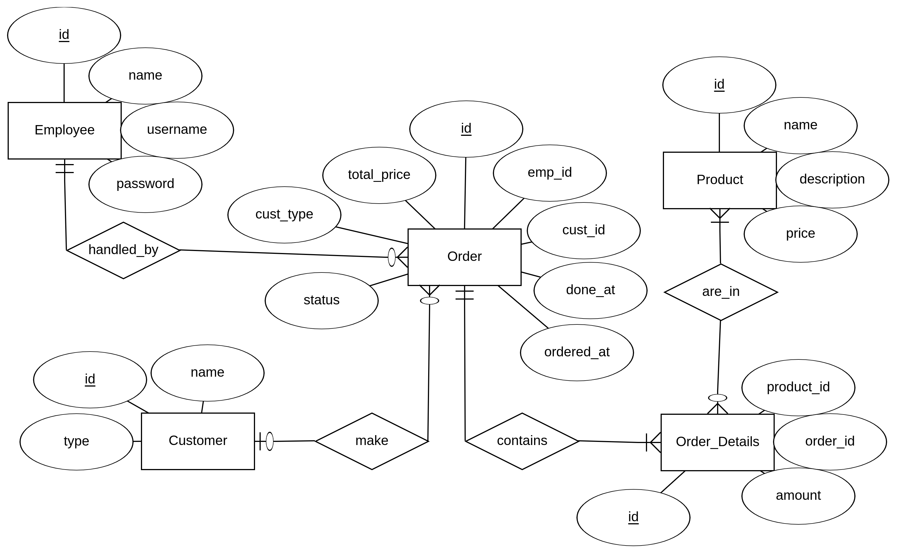

# Stall POS
Simple Stall POS built with Golang.

## Entity Relationship Diagram


## Installation
1. Get the project from this repo
   ```
   go get github.com/fannyhasbi/stall-pos
   ```
2. Import the `database.sql` into your local DB


## Endpoints
### Product
**GET** `/api/product`

### Employee
**GET** `/api/employee`

### Order
**POST** `/api/order/`